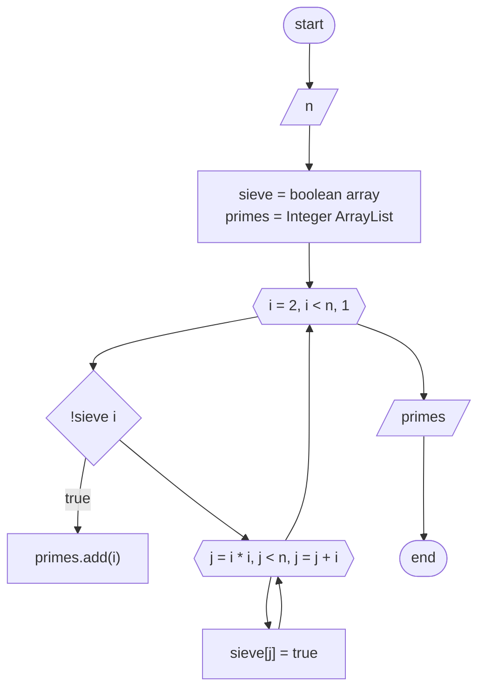

# Implementation of the sieve algorithm of Eratosthenes.
## Task.
The number n (n > 1) is given. Print a string consisting 
of prime numbers less than n. Use the sieve of Eratosthenes.
## Block diagram.

